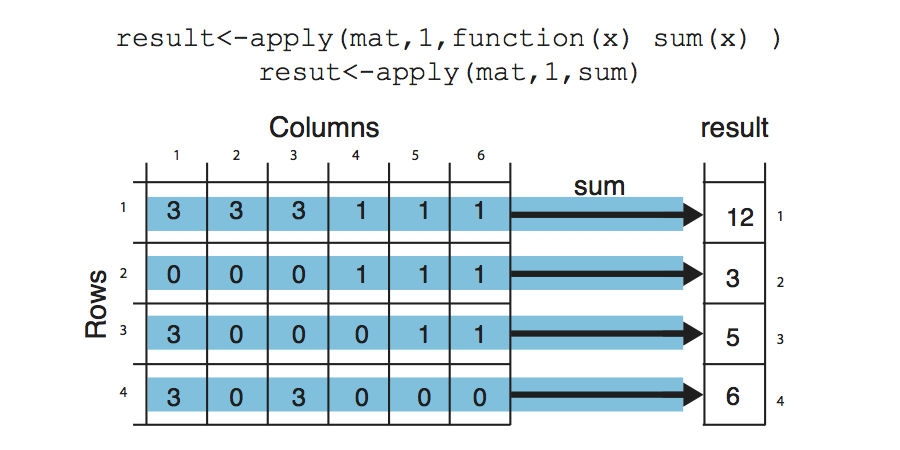

# Functions and control structures (for, if/else etc.)

## User defined functions
Functions are useful for transforming larger chunks of code to re- usable pieces of code. Generally, if you need to execute certain tasks with variable parameters then it is time you write a function. A func- tion in R takes different arguments and returns a definite output, much like mathematical functions. Here is a simple function takes two arguments, x and y, and returns the sum of their squares.


```r
sqSum <- function(x, y) {
    result = x^2 + y^2
    return(result)
}
# now try the function out
sqSum(2, 3)
```

```
## [1] 13
```


Functions can also output plots and/or messages to the terminal. Here is a function that prints a message to the terminal:

```r
sqSumPrint <- function(x, y) {
    result = x^2 + y^2
    cat("here is the result:", result, "\n")
}
# now try the function out
sqSumPrint(2, 3)
```

```
## here is the result: 13
```


Sometimes we would want to execute a certain part of the code only if certain condition is satisfied. This condition can be anything from the type of an object (Ex: if object is a matrix execute certain code), or it can be more compicated such as if object value is between certain thresholds. Let us see how they can be used3. They can be used anywhere in your code, now we will use it in a function.


```r
cpgi.df <- read.table("../data/subset.cpgi.hg18.bed", header = FALSE)
# function takes input one row of CpGi data frame
largeCpGi <- function(bedRow) {
    cpglen = bedRow[3] - bedRow[2] + 1
    if (cpglen > 1500) {
        cat("this is large\n")
    } else if (cpglen <= 1500 & cpglen > 700) {
        cat("this is normal\n")
    } else {
        cat("this is short\n")
    }
}
largeCpGi(cpgi.df[10, ])
largeCpGi(cpgi.df[100, ])
largeCpGi(cpgi.df[1000, ])
```


## Loops and looping structures in R
When you need to repeat a certain task or a execute a function multiple times, you can do that with the help of loops. A loop will execute the task until a certain condition is reached. The loop below is called a “for-loop” and it executes the task sequentially 10 times.

```r
for (i in 1:10) {
    # number of repetitions
    cat("This is iteration")  # the task to be repeated
    print(i)
}
```

```
## This is iteration[1] 1
## This is iteration[1] 2
## This is iteration[1] 3
## This is iteration[1] 4
## This is iteration[1] 5
## This is iteration[1] 6
## This is iteration[1] 7
## This is iteration[1] 8
## This is iteration[1] 9
## This is iteration[1] 10
```

The task above is a bit pointless, normally in a loop, you would want to do something meaningful. Let us calculate the length of the CpG islands we read in earlier. Although this is not the most efficient way of doing that particular task, it serves as a good example for looping. The code below will be execute hundred times, and it will calculate the length of the CpG islands for the first 100 islands in
the data frame (by subtracting the end coordinate from the start coordinate).


**Note:**If you are going to run a loop that has a lot of repetitions, it is smart to try the loop with few repetitions first and check the results. This will help you make sure the code in the loop works before executing it for thousands of times.


```r
# this is where we will keep the lenghts for now it is an empty vector
result = c()
# start the loop
for (i in 1:100) {
    # calculate the length
    len = cpgi.df[i, 3] - cpgi.df[i, 2] + 1
    # append the length to the result
    result = c(result, len)
}
```

```
## Error: object 'cpgi.df' not found
```

```r
# check the results
head(result)
```

```
## NULL
```


### apply family functions instead of loops
R has other ways of repeating tasks that tend to be more efficient than using loops. They are known as the **“apply”** family of functions, which include *apply,lapply, mapply and tapply* (and some other variants). All of these functions apply a given function to a set of instances and returns the result of those functions for each instance. The differences between them is that they take different type of inputs. For example apply works on data frames or matrices and applies the function on each row or column of the data structure. *lapply* works on lists or vectors and applies a function which takes the list element as an argument. Next we will demonstrate how to use **apply()** on a matrix. The example applies the sum function on the rows of a matrix, it basically sums up the values on each row of the matrix, which is conceptualized in Figure below.




```r
mat = cbind(c(3, 0, 3, 3), c(3, 0, 0, 0), c(3, 0, 0, 3), c(1, 1, 0, 0), c(1, 
    1, 1, 0), c(1, 1, 1, 0))
result <- apply(mat, 1, sum)
result
```

```
## [1] 12  3  5  6
```

```r
# OR you can define the function as an argument to apply()
result <- apply(mat, 1, function(x) sum(x))
result
```

```
## [1] 12  3  5  6
```

Notice that we used a second argument which equals to 1, that indicates that rows of the matrix/ data frame will be the input for the function. If we change the second argument to 2, this will indicate that columns should be the input for the function that will be applied. See Figure for the visualization of apply() on columns.


```r
result <- apply(mat, 2, sum)
result
```

```
## [1] 9 3 6 2 3 3
```

Next, we will use **lapply()**, which applies a function on a list or a vector. The function that will be applied is a simple function that takes the square of a given number.


```r
input = c(1, 2, 3)
lapply(input, function(x) x^2)
```

```
## [[1]]
## [1] 1
## 
## [[2]]
## [1] 4
## 
## [[3]]
## [1] 9
```

**mapply()** is another member of apply family, it can apply a function on an unlimited set of vectors/lists, it is like a version of lapply that can handle multiple vectors as arguments. In this case, the argument to the mapply() is the function to be applied and the sets of parameters to be supplied as arguments of the function. This conceptualized Figure below, the function to be applied is a function that takes to arguments and sums them up. The arguments to be summed up are in the format of vectors, Xs and Ys. mapply() applies the summation function to each pair in Xs and Ys vector. Notice that the order of the input function and extra arguments are different for mapply.


```r
Xs = 0:5
Ys = c(2, 2, 2, 3, 3, 3)
result <- mapply(function(x, y) sum(x, y), Xs, Ys)
result
```

```
## [1] 2 3 4 6 7 8
```


### apply family functions on multiple cores
If you have large data sets apply family functions can be slow (although probably still better than for loops). If that is the case, you can easily use the parallel versions of those functions from parallel package. These functions essentially divide your tasks to smaller chunks run them on separate CPUs and merge the results from those parallel operations. This concept is visualized at Figure below , mcapply runs the summation function on three different processors. Each processor executes the summation function on a part of the data set, and the results are merged and returned as a single vector that has the same order as the input parameters Xs and Ys.


## Vectorized Functions in R
The above examples have been put forward to illustrate functions and loops in R because functions using sum() are not complicated and easy to understand. You will probably need to use loops and looping structures with more complicated functions. In reality, most of the operations we used do not need the use of loops or looping structures because there are already vectorized functions that can achieve the same outcomes, meaning if the input arguments are R vectors the output will be a vector as well, so no need for loops or vectorization.

For example, instead of using mapply() and sum() functions we can just use + operator and sum up Xs and Ys.

```r
result = Xs + Ys
result
```

```
## [1] 2 3 4 6 7 8
```

In order to get the column or row sums, we can use the vectorized functions colSums() and rowSums().

```r
colSums(mat)
```

```
## [1] 9 3 6 2 3 3
```

```r
rowSums(mat)
```

```
## [1] 12  3  5  6
```

However, remember that not every function is vectorized in R, use the ones that are. But sooner or later, apply family functions will come in handy.
